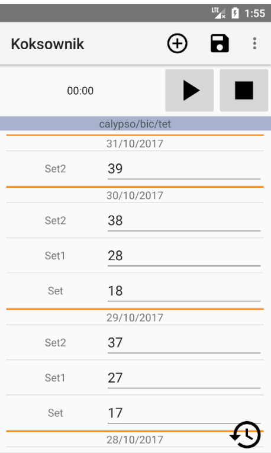
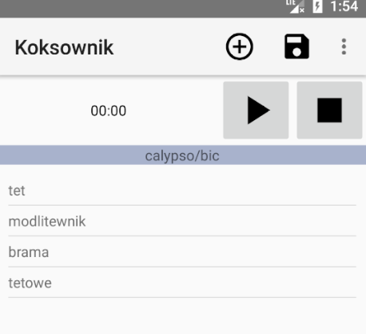

#Koksownik
Android app for noting gym proggress.

##Info
There are two types of nodes: directory node and details node. Each directory node can contain another directory node or details node.
Details node is final node that contains data you noted. Data in details node is grouped by date it was entered. By default last 2 days are loaded, there is button to load more.
Koksownik uses xml files to store data. All directory nodes are stored in one xml file, each details node has its own xml file. Xml file of details node gets parsed at first opening of that node.
Saving data to xml is accomplished by using VTD-XML libray. Reading is accomplished by XmlPullParser. 
I'm planning to switch to Java StAX Parser to get rid of GNU GPLv2

##Screenshot

#Credits
XimpleWare, info@ximpleware.com - for VTD-XML jar library - licensed under GNU GENERAL PUBLIC LICENSE Version 2, June 1991
The Apache Software Foundation - for Apache Commons IO jar library - licensed under Apache License, Version 2.0
Google - for Material design icons - licensed under Apache License, Version 2.0

#License
Koksownik is licensed under GNU GENERAL PUBLIC LICENSE Version 3 (see [LICENSE]LICENSE) and uses third party libraries that are distributed under their own terms (see [LICENSE-3RD-PARTY.txt]LICENSE-3RD-PARTY.txt)
